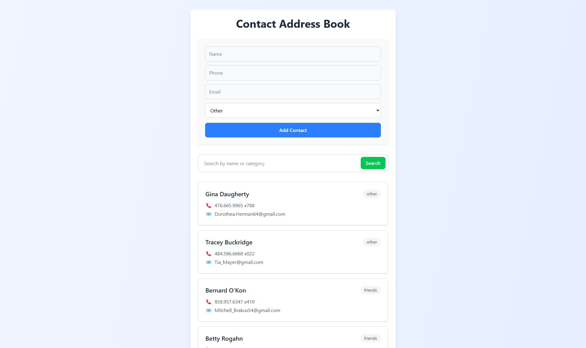

# Contact Address Book

A **full-stack web application** for managing your contacts effortlessly! Built with **React**, **Node.js**, **Express**, and **MongoDB**, it delivers a seamless experience for organizing your connections.

## Screenshot



### Screenshot of the contact address book application showing the contact list and add contact form

## 🚀 Features

- **Add Contacts**: Save names, phone numbers, emails, and categories.
- **Search Contacts**: Find what you need instantly by name or category.
- **Organized View**: View all your contacts in a clean, intuitive list.
- **Categorize**: Sort contacts by Family, Friends, Work, or Other.
- **Responsive Design**: Beautifully designed with Tailwind CSS for all devices.

---

## 🛠 Tech Stack

### **Frontend**

- **React**: Dynamic and interactive UI.
- **Axios**: Smooth API communication.
- **Tailwind CSS**: Stunning and responsive styling.
- **Vite**: Fast development and build tool.

### **Backend**

- **Node.js**: Reliable backend runtime.
- **Express.js**: Simplified server setup.
- **MongoDB + Mongoose**: Robust data storage.
- **Dotenv**: Manage environment variables with ease.

---

## 📋 Getting Started

1. **Clone the Repository**

   ```bash
   git clone https://github.com/AvishkaGihan/contact-address-book.git
   cd contact-address-book
   ```

2. **Install Dependencies**

   ```bash
   # Install backend dependencies
   npm install

   # Navigate to frontend directory and install dependencies
   cd frontend
   npm install
   ```

3. **Set Up Environment Variables**
   Create a `.env` file in the root directory with the following:

   ```env
   MONGO_URI=mongodb://localhost:27017/contact-address-book
   PORT=5000
   ```

4. **Seed the Database (Optional)**

   ```bash
   npm run seed
   ```

5. **Start Development Servers**

   ```bash
   npm run dev
   ```

   - **Backend**: Runs on `http://localhost:5000`
   - **Frontend**: Runs on `http://localhost:5173`

---

## 🎮 Available Scripts

| Command          | Description                              |
| ---------------- | ---------------------------------------- |
| `npm start`      | Starts the production server.            |
| `npm run server` | Starts the backend server with Nodemon.  |
| `npm run client` | Starts the frontend development server.  |
| `npm run dev`    | Runs frontend and backend concurrently.  |
| `npm run seed`   | Seeds the database with sample contacts. |
| `npm run build`  | Builds the frontend for production.      |

---

## 🌐 API Endpoints

| Method | Endpoint                            | Description                          |
| ------ | ----------------------------------- | ------------------------------------ |
| GET    | `/api/contacts`                     | Retrieve all contacts.               |
| POST   | `/api/contacts`                     | Create a new contact.                |
| GET    | `/api/contacts/search?query=<term>` | Search contacts by name or category. |

---

## 📁 Frontend Structure

```plaintext
frontend/
├── src/
│   ├── components/
│   │   ├── ContactForm.jsx      # Form to add/edit contacts
│   │   ├── ContactList.jsx      # Displays contact list
│   │   └── SearchBar.jsx        # Search functionality
│   ├── App.jsx                  # Main application component
│   └── main.jsx                 # Application entry point
```

---

## 🤝 Contributing

1. **Fork the repository**.
2. **Create a feature branch**:

   ```bash
   git checkout -b feature/amazing-feature
   ```

3. **Commit your changes**:

   ```bash
   git commit -m 'Add some amazing feature'
   ```

4. **Push to the branch**:

   ```bash
   git push origin feature/amazing-feature
   ```

5. **Open a Pull Request**.

---

## 📜 License

This project is licensed under the **ISC License**.

---

### 🌟 Show your support by starring the repo and sharing it with others
